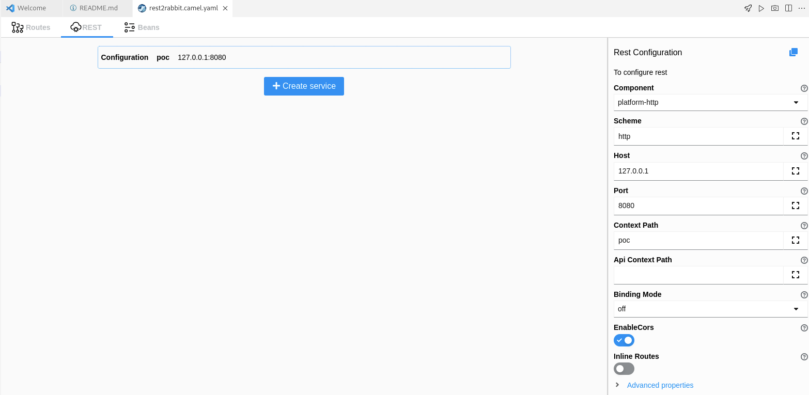
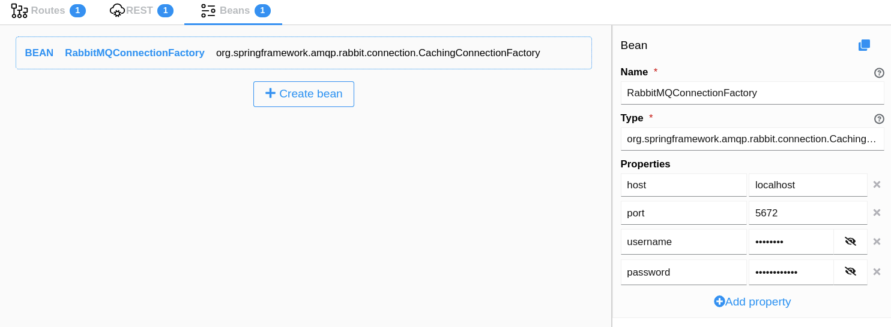
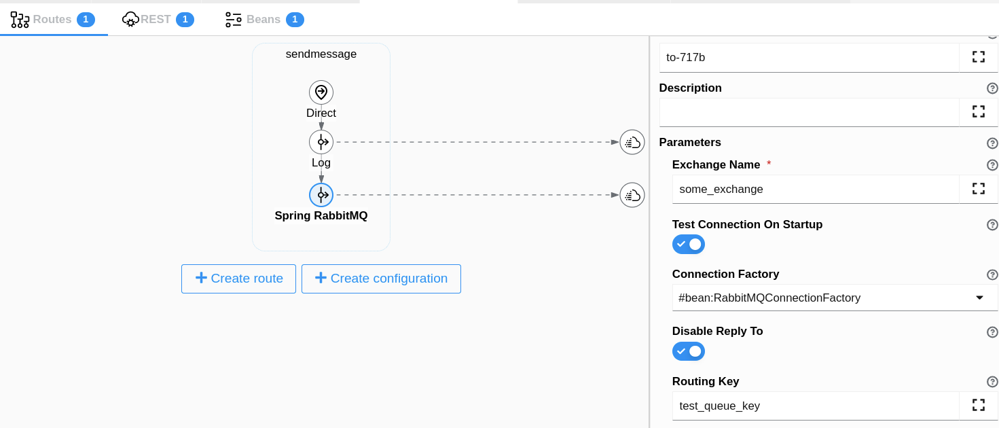

# REST API to RabbitMQusing Camel

This is a step by step guide about how to create a Camel integration straightfordward which sends the body payload recieved in REST API endpoint to a RabbitMQ exchange.

## PreRequisites
- Visual Studio Code with Camel and Karavan plugins
- RabbitMQ 
- JBang: https://www.jbang.dev/download/
- Add this image base in your OpenShift cluster to build the integration service: registry.access.redhat.com/ubi8/openjdk-11:1.10

## Preparing RabbitMQ 

These commands are to create these RabbitMQ items: user, exchange, queue and bind the exchange with the queue.

Inside into the container (examples podman exec -it numcontainer bash or oc rsh RabbitMQpodname)
```
rabbitmqctl add_user testuser testpassword
rabbitmqctl set_user_tags testuser administrator
rabbitmqctl set_permissions -p / testuser ".*" ".*" ".*"

rabbitmqadmin declare exchange --vhost=/ name=some_exchange type=direct
rabbitmqadmin declare queue --vhost=/ name=test_queue durable=true
rabbitmqadmin --vhost="/" declare binding source="some_exchange" destination_type="queue" destination="test_queue" routing_key="test_queue_key"
```
# How to build 
1. Clone this project.
2. Open application.properties file and replace the {namespace} varaible by your namespace.
3. Open rest2rabbit.camel.yaml set up in the "beans" section your correct rabbitmq parameters: host,port,username and password .
3. Sign in your OpenShift cluster, this command will deploy the integration route in it:
   ```
   jbang -Dcamel.jbang.version=3.21.0 camel@apache/camel export --fresh  --directory={PROJECT_PATH}/.export && mvn clean package -f .export
   ```

    
# Steps to create this demo from scratch.
 - VSCode -> run "Karavan: Create integration" on Command Palette. It creates a yaml file which you can draw your integration.
 - Open the yaml file with Karavan editor and follow these steps:
     - Configure the REST API with REST-DSL.
     - Define the Connection Factory to point the RabbitMQ instance.
     - Configure the camel spring-rabbitmq component.
     
### REST DSL Configuration


### Define Connection factory


### Define the Camel integration route



## TEST
```
curl --location --request POST 'localhost:8080/poc/message2rabbit' \
--header 'Content-Type: application/json' \
--data-raw '{
    "hello":"world"
}'
```
Testing the RabbitMQ exchange, it sends a message to the exchange:
```
rabbitmqadmin publish exchange=some_exchange routing_key=test_queue_key payload="hello, world"
```
Monitoring the RabbitMQ queue
```
rabbitmqadmin list queues vhost name node messages
```

jbang -Dcamel.jbang.version=3.21.0 camel@apache/camel export --fresh  --directory=/home/sgutierr/development/PoC/zain/rest2rabbit/.export && mvn clean package -f ../rest2rabbitroute


## Create a Camel Project (OPTIONAL).

This in not necessary for this demo because all the functionality can be configured by the CAMEL YAML DSL without any other extension. However in other use cases which require for instance add a custom processor, POJO, or whatever other java object you should create a Camel Project to include those files. Thanks a JBang it is easy to create a scaffold project with the pom.xml (including the dependencies required), the DSL Yaml file, application.properties and other project files to deploy.

This command creates a quarkus project based on the YAML DSL you draw:
```
jbang -Dcamel.jbang.version=3.21.0 camel@apache/camel export --fresh  --directory=../myproject --runtime=quarkus --gav=org.demo:rest2rabbit:1
```
Don't forge to run the project
```
./mvnw quarkus:dev
```
